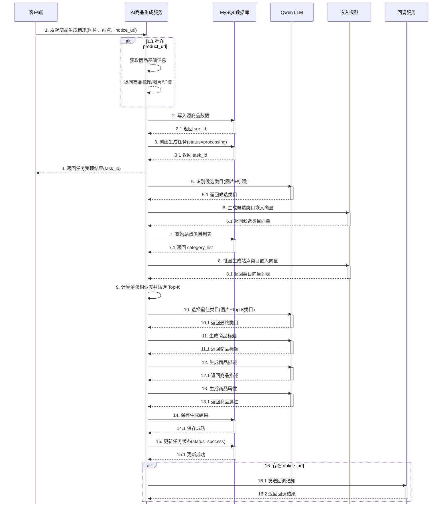

# AI 商品列表生成服务

## 项目介绍

本项目是一个基于 FastAPI 的 AI 辅助电商商品上架接口服务，旨在帮助卖家在多平台上架商品时，自动生成符合各平台要求的商品信息。

### 核心功能

1. **AI 商品列表生成** (`/api/r1/shop/ailist`)
   - 通过商品图片识别商品类目（基于 BGE-M3 多语言嵌入向量相似度匹配）
   - AI 生成商品标题（多语言支持）
   - AI 生成商品描述（多语言支持）
   - AI 生成商品属性

2. **文本翻译** (`/api/r1/c/translate`, `/api/r1/c/batchtranslate`)
   - 单文本翻译
   - 批量文本翻译
   - 多语言支持

3. **图片 OCR 识别** (`/api/r1/c/ocr`)
   - 从商品图片中提取文字信息

### 技术栈

- **Web 框架**: FastAPI
- **数据库**: MySQL (SQLAlchemy ORM)
- **AI 模型**: 
  - **BGE-M3** (BAAI General Embedding M3) - 用于商品类目多语言嵌入匹配
  - Qwen (通义千问) - 用于商品标题、描述、属性生成
  - Gemini - 备用 LLM
- **API 调用**: OpenAI SDK (兼容 OpenAI 格式)


**---**

## API 时序图

### 商品列表生成流程 (ailist)

#### 异步模式（有回调地址）



---

## BGE 模型 Docker 部署

本项目使用 **BGE-M3 (BAAI General Embedding M3)** 多语言嵌入模型进行商品类目匹配，通过嵌入向量相似度计算，将 AI 识别的类目路径与数据库中的目标站点类目进行智能匹配。

> **BGE-M3** 特点：支持超过100种语言的稠密嵌入、稀疏嵌入和混合检索，是当前性能最优的开源嵌入模型之一。

### 部署方式

BGE 模型通过 **Docker** 部署为 API 服务，使用 [FlagOpen/FlagEmbedding](https://github.com/FlagOpen/FlagEmbedding) 项目提供的服务化脚本。

### 1. 启动 BGE-M3 服务

```bash
docker run --gpus all -p 8000:80 -v "%cd%\data:/data" ghcr.io/huggingface/text-embeddings-inference:cuda-1.8.1 --model-id BAAI/bge-m3
```

### 2. 配置存储在数据库

所有配置存储在 MySQL 数据库的 `sys_conf` 表中，系统启动时自动读取：

| key | 说明 | 示例值 |
|-----|------|--------|
| EMBEDDING_API_KEY | API 认证密钥 | dummy |
| EMBEDDING_BASE_URL | BGE 服务 API 地址 | http://bge-container-ip:8000/v1 |
| EMBEDDING_MODEL | BGE 模型名称 | BAAI/bge-m3 |

配置示例（插入数据库）：

```sql
INSERT INTO sys_conf (`key`, `value`, `enable`) VALUES 
('EMBEDDING_API_KEY', 'dummy', 1),
('EMBEDDING_BASE_URL', 'http://192.168.1.100:8080/v1', 1),
('EMBEDDING_MODEL', 'BAAI/bge-m3', 1);
```

> 应用会在调用嵌入服务时从数据库动态读取这些配置，修改配置后无需重启服务。


```

配置数据库（sys_conf 表）：
| key | value |
|-----|-------|
| EMBEDDING_BASE_URL | http://localhost:11434/v1 |
| EMBEDDING_API_KEY | ollama |
| EMBEDDING_MODEL | BAAI/bge-m3 |

---

## 环境变量

| 变量名 | 说明 | 默认值 |
|--------|------|--------|
| MYSQL_HOST | MySQL 主机 | localhost |
| MYSQL_PORT | MySQL 端口 | 3306 |
| MYSQL_USERNAME | MySQL 用户名 | xx |
| MYSQL_PASSWORD | MySQL 密码 | xx |
| MYSQL_DATABASE | 数据库名 | xx |

---

## 快速启动

1. 安装依赖：
```bash
pip install -r requirements.txt
```

2. 配置数据库连接（修改 `app/config.py`）

3. 启动服务：
```bash
python -m app.main
```

服务将在 `http://localhost:1235` 启动

