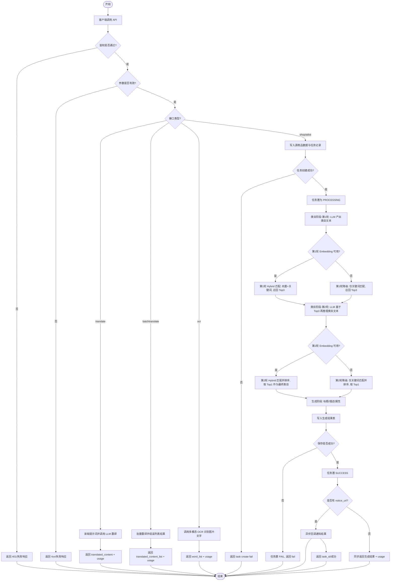
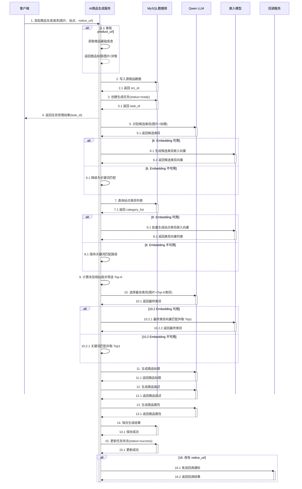

# AI 商品列表生成服务

## 项目介绍

本项目是一个基于 FastAPI 的 AI 辅助电商商品上架接口服务，旨在帮助卖家在多平台上架商品时，自动生成符合各平台要求的商品信息。

### 核心功能

1. **AI 商品列表生成** (`/api/r1/shop/ailist`)
   - 基于图片+标题进行类目推理，并通过 hybrid（向量+关键词）匹配站点类目
   - AI 生成商品标题（多语言支持）
   - AI 生成商品描述（多语言支持）
   - AI 生成商品属性

2. **文本翻译** (`/api/r1/c/translate`, `/api/r1/c/batchtranslate`)
   - 单文本翻译
   - 批量文本翻译
   - 多语言支持

3. **图片 OCR 识别** (`/api/r1/c/ocr`)
   - 从商品图片中提取文字信息

### 技术栈

- **Web 框架**: FastAPI
- **数据库**: MySQL (SQLAlchemy ORM)
- **AI 模型**:
  - **Embedding 模型（可选）** - 用于类目语义匹配（未配置时自动降级到关键词匹配）
  - Qwen (通义千问) - 用于商品标题、描述、属性生成
  - Gemini - 备用 LLM
- **API 调用**: OpenAI SDK (兼容 OpenAI 格式)


---

## 项目流程思维导图（场景化）

### 1) 流程梳理（文字版）

- 项目名称：`ai_list_generate`
- 项目目标：面向电商上架场景，提供 AI 商品信息生成、文本翻译、图片 OCR，并对商品生成任务做状态追踪与结果落库。
- 参与角色：用户/调用方、前端、FastAPI 后端、MySQL、LLM/多模态第三方接口、可选回调服务。
- 流程范围：从用户提交请求到同步返回结果或异步回调完成。

主流程步骤：

1. 客户端发起 API 请求（翻译/批量翻译/OCR/商品生成）。
2. 后端进行鉴权与参数校验，不通过则直接返回错误。
3. 根据接口类型进入对应业务流程。
4. 翻译与 OCR：调用模型后直接返回结果与 usage。
5. 商品生成：先写源商品与任务，再执行类目识别、标题生成、描述生成、属性生成。
6. 类目识别优先走 embedding + 关键词混合匹配；embedding 不可用时自动降级关键词匹配。
7. 保存生成结果并更新任务状态（SUCCESS/FAIL）。
8. 有 `notice_url` 时异步回调，无 `notice_url` 时同步返回最终生成内容。

### 2) 标准流程图（Mermaid）



---

## API 时序图

### 商品列表生成流程 (ailist)

#### 异步模式（有回调地址）



---

## BGE 模型 Docker 部署

本项目可使用 embedding 模型进行商品类目语义匹配；若 embedding 未配置或不可用，系统会自动降级为关键词匹配，不阻断主流程。

> 说明：当前代码通过 `db_sys_conf` 读取 `EMBEDDING_*` 配置。

### 部署方式

BGE 模型通过 **Docker** 部署为 API 服务，使用 [FlagOpen/FlagEmbedding](https://github.com/FlagOpen/FlagEmbedding) 项目提供的服务化脚本。

### 1. 启动 BGE-M3 服务

```bash
docker run --gpus all -p 8000:80 -v "%cd%\data:/data" ghcr.io/huggingface/text-embeddings-inference:cuda-1.8.1 --model-id BAAI/bge-m3
```

### 2. 配置存储在数据库

所有配置存储在 MySQL 数据库的 `db_sys_conf` 表中，系统启动时自动读取：

| key | 说明 | 示例值 |
|-----|------|--------|
| EMBEDDING_API_KEY | API 认证密钥 | dummy |
| EMBEDDING_BASE_URL | BGE 服务 API 地址 | http://bge-container-ip:8000/v1 |
| EMBEDDING_MODEL | BGE 模型名称 | BAAI/bge-m3 |

配置示例（插入数据库）：

```sql
INSERT INTO db_sys_conf (`key`, `value`, `enable`) VALUES
('EMBEDDING_API_KEY', 'dummy', 1),
('EMBEDDING_BASE_URL', 'http://192.168.1.100:8080/v1', 1),
('EMBEDDING_MODEL', 'BAAI/bge-m3', 1);
```

> 应用会在调用嵌入服务时从数据库动态读取这些配置，修改配置后无需重启服务。

---

## 环境变量

| 变量名 | 说明 | 默认值 |
|--------|------|--------|
| MYSQL_HOST | MySQL 主机 | localhost |
| MYSQL_PORT | MySQL 端口 | 3306 |
| MYSQL_USERNAME | MySQL 用户名 | root |
| MYSQL_PASSWORD | MySQL 密码 | 123456 |
| MYSQL_DATABASE | 数据库名 | ai_list |

---

## 快速启动

1. 安装依赖：
```bash
uv venv .venv
uv sync
```

2. 配置数据库连接（推荐使用环境变量）

3. 启动服务：
```bash
uv run uvicorn app.main:app --host 0.0.0.0 --port 1235 --reload
```

服务将在 `http://localhost:1235` 启动


## AI 路由与评测（新增）

### 1. 按任务路由模型

系统支持通过 `db_ai_model_route` 按 `task_type + scene` 选择模型。请求可通过 Header 传入：

- `x-ai-scene: default`（默认）

已接入任务类型：

- `shop_category`
- `shop_title`
- `shop_desc`
- `shop_attribute`
- `translate`
- `batch_translate`
- `ocr`

### 2. 离线评测脚手架

评测脚本：`app/eval/run_eval.py`

示例：

```bash
uv run python app/eval/run_eval.py --base-url http://localhost:1235 --scene default
```

评测数据：

- `app/eval/datasets/translate_eval.jsonl`
- `app/eval/datasets/ocr_eval.jsonl`

### 企业评测命令（推荐）

```bash
uv run python app/eval/run_eval.py --base-url http://localhost:1235 --scene default --compare-scene promo --min-success-rate 0.95 --out app/eval/reports/report_ab.json
```

输出包含：
- success_rate / valid_output_rate
- avg/p50/p95/p99 延迟
- token 统计
- 错误分类（auth/validation/server/timeout/connection）
- 双场景差异（delta）
