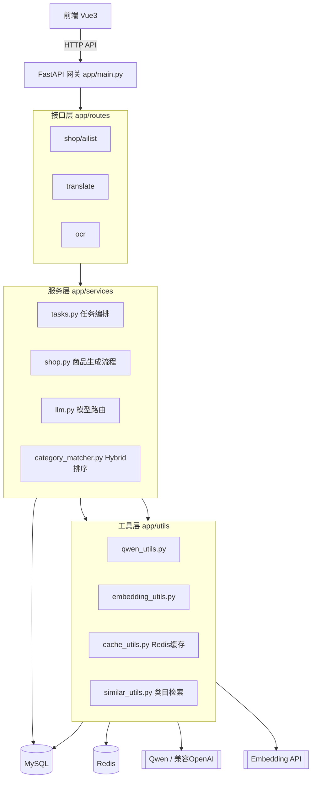
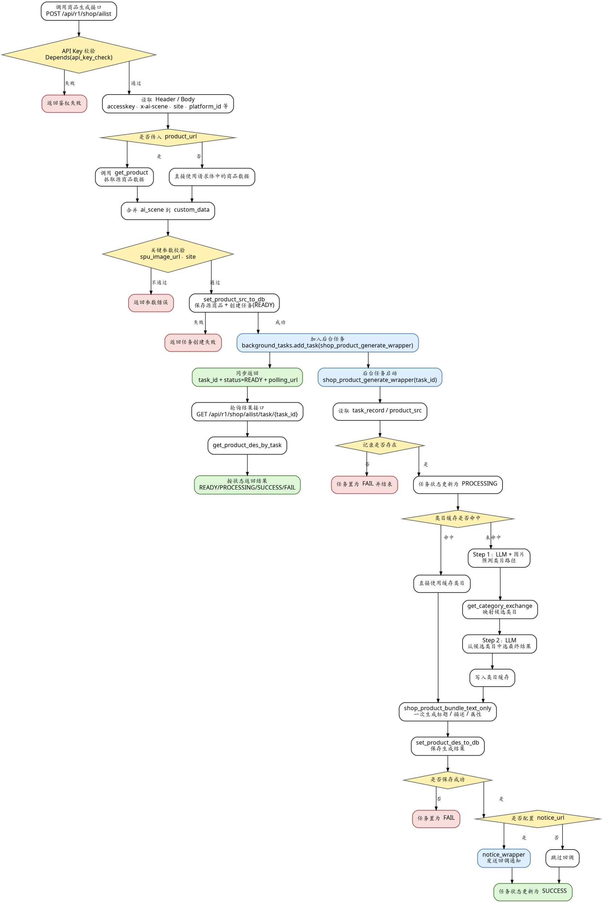
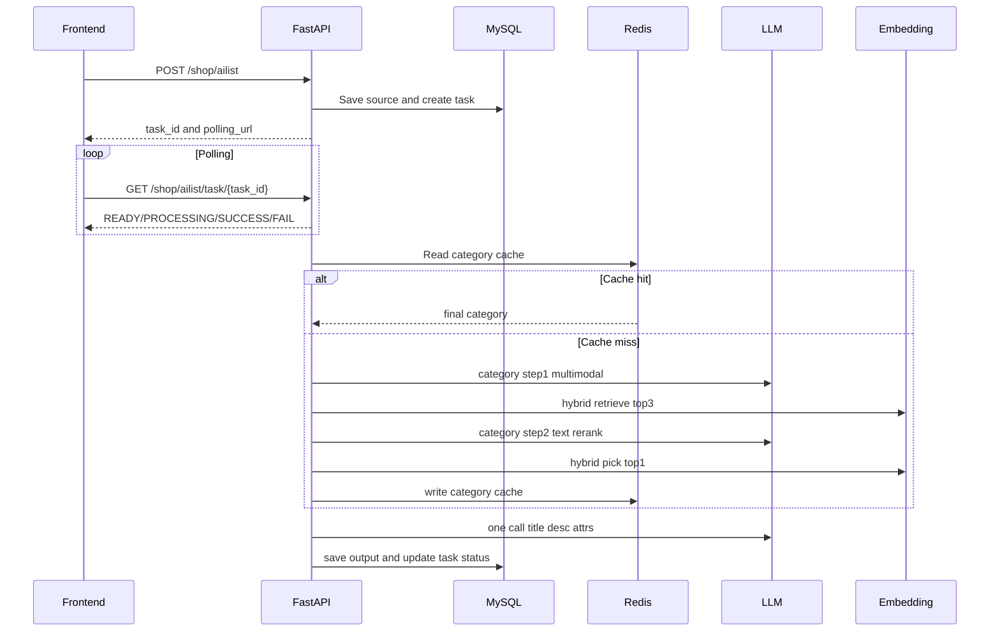

# AI Listing Generate

这个项目核心是在做一件事：把“电商商品上架文案与类目整理”自动化，减少人工编辑和跨平台适配成本。

解决的问题

1.不同站点类目体系不一致，人工选类目容易错。

2.卖家上架商品时，标题/描述/属性生成很耗时，且质量不稳定。

3.多语言翻译和图片 OCR 是高频辅助动作，手工处理效率低。

4.需要可追踪任务（同步返回或异步回调），便于系统集成。

---

## 技术栈

- 后端：FastAPI
- 前端：Vue3 + Vite
- 数据库：MySQL（SQLAlchemy）
- 缓存：Redis（类目缓存、Embedding 缓存）
- 大模型：Qwen（通过兼容 OpenAI 接口调用）
- 向量能力：Embedding API（本地或远端）
- 包与环境：uv / Python 3.11+

---

## 1. 项目架构图



---

## 2. 主流程图（商品生成）



## 3. 时序图（异步任务 + 轮询）



---

## 4. 目录分层

- `app/main.py`：应用入口、路由注册、中间件
- `app/routes/`：接口层（参数接收、调用 service、返回响应）
- `app/services/`：业务流程编排（任务、类目、生成）
- `app/utils/`：模型调用、embedding、缓存、通用工具
- `app/models/`：ORM 模型
- `app/schemas/`：请求/响应结构
- `app/database.py`：数据库连接管理
- `app/config.py`：统一配置与日志
- `app/sql/`：建表/初始化 SQL
- `frontend/`：Vue3 + Vite 前端

---

## 5. 快速启动

### 5.1 后端

```bash
uv venv .venv
uv sync
uv run uvicorn app.main:app --reload
```

### 5.2 前端

```bash
cd frontend
npm install
npm run dev
```
docker 向量库
docker run --gpus all -p 8000:80 -v "%cd%\data:/data" ghcr.io/huggingface/text-embeddings-inference:cuda-1.8.1 --model-id BAAI/bge-m3
---

## 6. 配置说明

项目支持从根目录 `.env` 读取配置（`app/config.py` 已加载）。

可参考 `.env.example`：
- `MYSQL_USERNAME`
- `MYSQL_PASSWORD`
- `MYSQL_HOST`
- `MYSQL_PORT`
- `MYSQL_DATABASE`
- `REDIS_URL`
- `CATEGORY_CACHE_TTL_SECONDS`
- `EMBEDDING_CACHE_TTL_SECONDS`

---

## 7. 已实现的关键优化

- 类目第二步从多模态改为文本重排，降低时延
- 类目结果 Redis 缓存（重复请求明显提速）
- Embedding Redis 缓存（单条与批量均支持）
- 商品文案合并为一次生成（标题+描述+属性）

---

## 8. 测试与报告

- API 测试目录：`app/test_api/`
- 并发压测报告：`app/test_api/concurrency_test_report_20260407.md`

